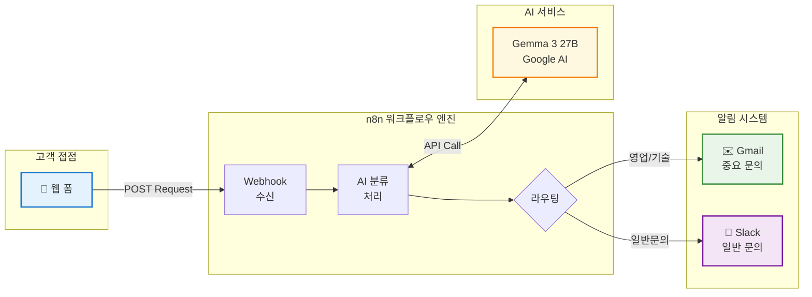
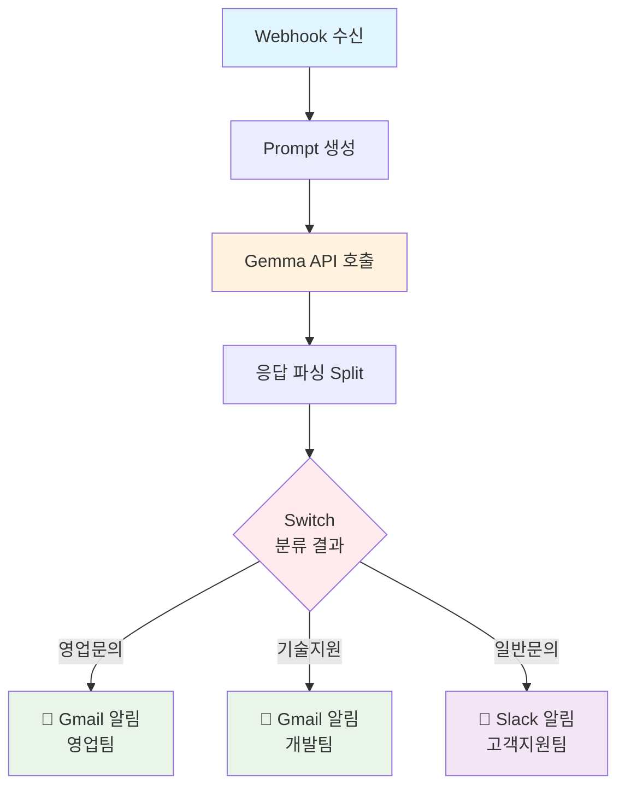

# 고객 문의 자동 분류 시스템

## 📋 프로젝트 개요

AI를 활용하여 고객 문의를 자동으로 분류하고 적절한 담당자에게 알림을 전송하는 자동화 시스템입니다.


## 🛠️ 기술 스택

- **워크플로우 엔진**: n8n (1.104.2)
- **AI 모델**: Google Gemma 3 27B 1T
- **API**: Google Generative Language API
- **알림 시스템**: 
  - Gmail (이메일 알림)
  - Slack (팀 협업 채널)
- **인증**: OAuth2 (Gmail), API Key (Slack)
- **배포**: Docker 기반 Self-Hosted

## 🏗️ 시스템 아키텍처


### 시스템 구성도




### 다이어그램




## 🤖 LLM 프롬프트 설계

### 핵심 설계 원칙

1. **명확한 분류 기준 제시**
   ```
   [영업 문의, 기술 지원, 일반 문의] 중 하나로 분류
   ```

2. **정형화된 출력 형식 강제**
   ```
   응답은 반드시 '문의유형 숫자' 형식으로 출력
   예: 기술 지원 3
   ```

3. **추가 설명 차단**
   ```
   다른 말이나 설명은 절대로 하지 마세요.
   ```

### 프롬프트 전문
```javascript
`아래의 문의 내용을 [영업 문의, 기술 지원, 일반 문의] 중 하나로 분류해주세요.
긴급도를 1~10 숫자로만 분류해서 함께 출력해주세요.

문의 내용: ${message}

응답은 반드시 '문의유형 숫자' 형식으로 출력하세요. 예: 기술 지원 3
다른 말이나 설명은 절대로 하지 마세요.`
```

### 프롬프트 설계 고려사항

- **일관성**: 매번 동일한 형식의 결과를 얻기 위해 엄격한 출력 규칙 적용
- **파싱 용이성**: `split(" ")`으로 쉽게 분리할 수 있는 단순한 형식
- **오류 방지**: 추가 설명이나 부연 설명을 차단하여 파싱 오류 최소화
- **명확한 지시**: AI가 혼동하지 않도록 구체적이고 명확한 지침 제공


## 🚨 문제 해결 과정

### 1. JSON 파싱 오류
**문제**: 고객 문의에 쌍따옴표가 포함되면 JSON 구조 파괴
```
JSON parameter needs to be valid JSON
```

**해결**: Code 노드를 사용한 안전한 문자열 처리, JSON.stringify 함수 사용


### 2. API 문제

**문제**: Hugging Face Interface 정확도 떨어짐

**문제**: Clova Studio HCX-007 베타 버전이라 무료인줄 알았지만 유료

**문제**: Gemini API 무료 할당량 초과
```
The service is receiving too many requests from you
```

**해결**: Gemma 3 27B IT로 모델 변경


### 3. 폼 제출 오류
**문제**: 폼 제출 시 CORS 오류

**해결**: n8n 셀프 호스팅

### 3. 웹 훅 url 불일치
**문제**: Self-Hosted 시 웹 훅 url이 변경되는 문제

**해결**: 도메인 구매

#### 웹훅 URL
https://bbutterbread.shop/webhook/customer-inquiry


## 📞 지원 및 문의

- **개발자**: 정유진
- **이메일**: juj990717@gmail.com

---

